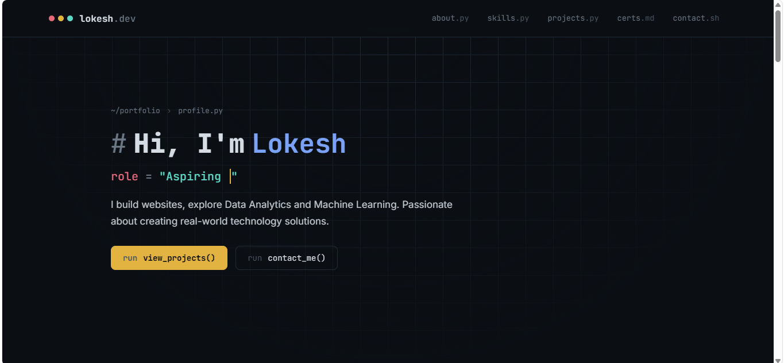

## 📸 Website Preview


# 🌐 Portfolio Website

Welcome to my personal portfolio website! This website showcases my skills, projects, achievements, and contact information.

## 🚀 About the Project

This portfolio website was developed to present my technical skills, projects, and experience in web development. It serves as a platform to highlight my work and connect with recruiters and developers.

## ✨ Features

- Responsive design
- Clean and modern UI
- About Me section
- Skills section
- Projects showcase
- Contact section
- Smooth navigation

## 🛠️ Technologies Used

- HTML
- CSS
- JavaScript

## 📂 Project Structure

```
portfolio-website/
│
├── index.html
├── style.css
├── script.js
├── assets/
└── README.md
```

## 💻 Getting Started

1. Clone the repository:

```bash
git clone https://github.com/your-username/portfolio-website.git
```

2. Open the project folder.

3. Run `index.html` in your browser.

## 🔗 Live Demo

Add your portfolio website link here.

## 📬 Contact

- LinkedIn: Your LinkedIn profile
- GitHub: Your GitHub profile
- Email: Your email address

---

Thank you for visiting my portfolio website! Feel free to explore the projects and connect with me.
